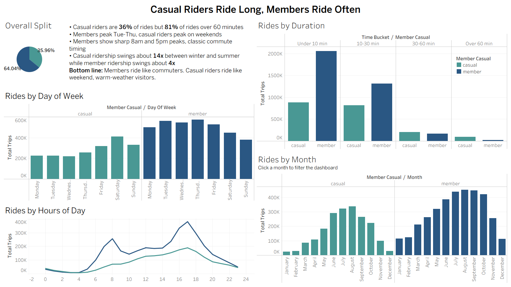

# Cyclistic Bikeshare Case Study

How do annual members and casual riders use Cyclistic bikes differently? Google Data Analytics Capstone Project, analysis of roughly 5.5 million rides from January to December 2025.

## Project

Cyclistic is a Chicago-based bike-share program offering single-ride passes, full-day passes, and annual memberships. Riders on single-ride or full-day passes are classified as casual riders, riders with annual memberships are classified as members.

Cyclistic's Director of Marketing believes future growth depends on converting casual riders into annual members, rather than acquiring entirely new customers. This project answers the first of three questions guiding that strategy.

**How do annual members and casual riders use Cyclistic bikes differently?**

Casual riders and members use the service in almost opposite ways. Members ride like commuters, short trips, weekday-heavy, with sharp 8am and 5pm peaks, and volume holds steady year round. Casual riders ride less often overall but take longer, more weekend and summer-concentrated trips, and account for 80.64% of all rides over 60 minutes despite being only 35.96% of total ridership. That duration gap is the clearest, most quantifiable opening for a conversion campaign.

**[View the interactive dashboard on Tableau Public](https://public.tableau.com/views/cyclistic_17844834145490/CyclisticDashboard)**

## Languages and tools used

- Python (pandas) for data cleaning and preparation
- SQL (Google BigQuery) for analysis
- Tableau for visualization

## Key learning

- Combined and cleaned 12 monthly CSV files (about 5.55 million raw rows) into a single dataset in pandas, handling duplicates, missing fields, and out-of-range dates
- Wrote BigQuery SQL to extract ride counts, duration statistics, weekly and hourly patterns, seasonality, and duration-bucket breakdowns
- Cross-validated key findings across Python, SQL, and Tableau to confirm consistency rather than trusting a single tool's output
- Distinguished a genuine, quantifiable pattern (the duration gap) from patterns that looked plausible but did not hold up under direct testing (bike type, geography)
- Translated ride-level statistical patterns into business recommendations with honest tradeoffs, not one-sided pitches

## Challenges overcome

- Deciding how to treat rides with zero, negative, or 24+ hour durations, resolved by aligning the cutoff with Divvy's own published policy on unreturned bikes
- Separating a real behavioral difference (ride duration and timing) from a pattern that looked meaningful on a map but did not hold once member ridership's higher overall volume was accounted for
- Keeping the analysis honest by reporting non-findings (bike type, geography) explicitly rather than omitting patterns that did not support a clean story

## Resources

### Analytics

- [cyclistic_data_cleaning.ipynb](./cyclistic_data_cleaning.ipynb) - Python/pandas notebook that combines, cleans and prepares the 12 monthly raw files
- [bikeshare_analysis_queries.sql](./bikeshare_analysis_queries.sql) - BigQuery queries for ride counts, duration stats, weekly/hourly patterns, seasonality, and duration-bucket breakdowns, annotated with the business question and finding behind each query

### Visualization

- [Live dashboard on Tableau Public](https://public.tableau.com/views/cyclistic_17844834145490/CyclisticDashboard) - full interactive version, includes a click-to-filter action on the monthly chart
- [Cyclistic_Dashboard.twbx](./Cyclistic_Dashboard.twbx) - packaged Tableau workbook with data included, for opening locally in Tableau Desktop or Tableau Public

### Report

- [Cyclistic_Case_Study.docx](./Cyclistic_Case_Study.pdf) - Full written case study with findings, recommendations and next steps
